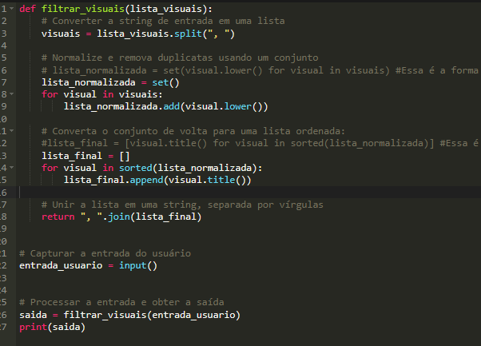
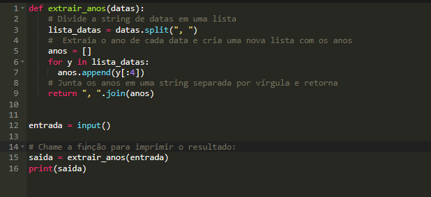

# DesafioDominandoeExtraindoDadosComPython

' Aqui colocarei a resolução do problema no exercicios propostos pela DIO'.

# Desafio 01 -  Filtragem de Visuais

### Explicação do exercicio:

Você tem uma lista de tipos de visuais e precisa processar essa lista para remover duplicatas e normalizar os nomes dos visuais. O objetivo é garantir que cada visual apareça apenas uma vez na lista e que todos os nomes estejam em um formato uniforme.

Remover Duplicatas: É comum em listas que certos itens apareçam mais de uma vez. Para evitar isso, precisamos garantir que cada tipo de visual apareça apenas uma vez na lista final.

Normalizar Nomes: Quando os usuários digitam nomes, eles podem usar diferentes formatos de capitalização (maiúsculas e minúsculas). Por exemplo, "gráfico de barras" e "Gráfico de Barras" são essencialmente o mesmo visual, mas escritos de maneiras diferentes. Precisamos padronizar esses nomes para que todos sigam o mesmo formato, facilitando a comparação e a remoção de duplicatas.

Para normalizar os nomes, vamos usar a capitalização do tipo "Título Capitalizado", onde a primeira letra de cada palavra é maiúscula e as demais letras são minúsculas. Por exemplo, "gráfico de barras" se tornará "Gráfico De Barras".

Entrada
O usuário irá fornecer uma lista de tipos de visuais como uma única string, onde cada visual é separado por vírgulas. A lista pode conter visuais repetidos ou escritos de maneira inconsistente.

Saída
Uma lista com visuais únicos e normalizados.

Exemplos
A tabela abaixo apresenta exemplos com alguns dados de entrada e suas respectivas saídas esperadas. Certifique-se de testar seu programa com esses exemplos e com outros casos possíveis.

Entrada	Saída
Gráfico de Barras, Gráfico de Barras, Tabela, Gráfico de Pizza, gráfico de barras	Gráfico De Barras, Gráfico De Pizza, Tabela
Gráfico de Linhas, gráfico de linhas, Tabela, tabela, gráfico de Linhas, Tabela Dinâmica	Gráfico De Linhas, Tabela, Tabela Dinâmica
gráfico de pizza, Gráfico de Pizza, gráfico de pizza, gráfico de colunas, Gráfico de Barras, gráfico de colunas	Gráfico De Barras, Gráfico De Colunas, Gráfico De Pizza
Atenção: É extremamente importante que as entradas e saídas sejam exatamente iguais às descritas na descrição do desafio de código.  

## Resolução do exercicio:

# Desafio 02 - Extração de anos

### Explicação do exercicio:

Neste desafio, você precisa processar uma lista de datas fornecida pelo usuário para extrair o ano de cada uma delas. A extração de anos pode ser útil para diversas aplicações, como a realização de análises anuais em grandes volumes de dados temporais.

Passo a Passo:

Entrada de Dados: O usuário fornecerá uma sequência de datas no formato "YYYY-MM-DD", onde "YYYY" representa o ano, "MM" o mês, e "DD" o dia. Todas as datas serão fornecidas em uma única linha, separadas por vírgula e espaço. Por exemplo: "2024-01-15, 2023-11-22, 2024-05-10".

Processamento dos Dados: O objetivo é isolar a parte correspondente ao ano de cada data. Isso pode ser feito dividindo cada string de data pelo caractere - e selecionando a primeira parte, que corresponde ao ano.

Formatação da Saída: Após extrair os anos, você deve retorná-los como uma nova lista, onde os anos estão separados por vírgulas. É importante manter a ordem original das datas fornecidas pelo usuário.

Entrada
Uma lista de datas no formato "YYYY-MM-DD" separados por vírgula.

Saída
Uma lista com os anos extraídos.

Exemplos
A tabela abaixo apresenta exemplos com alguns dados de entrada e suas respectivas saídas esperadas. Certifique-se de testar seu programa com esses exemplos e com outros casos possíveis.

Entrada	Saída
2024-01-01, 2023-07-19	2024, 2023
2022-12-31, 2021-01-01, 2020-05-25	2022, 2021, 2020
2025-09-09, 2025-10-10, 2026-03-03, 2027-07-07	2025, 2025, 2026, 2027

